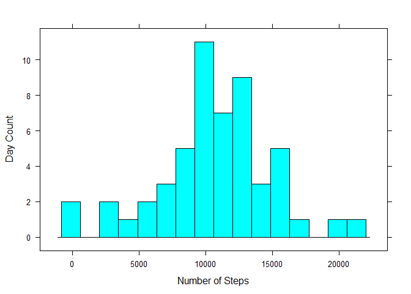
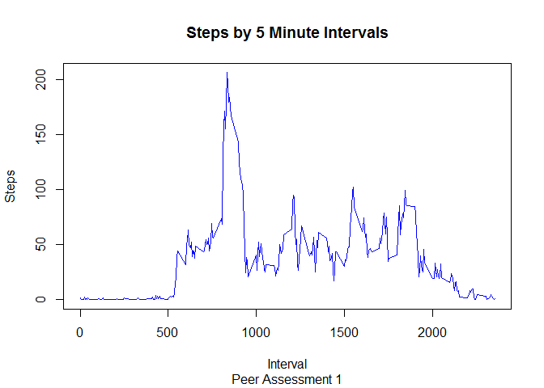
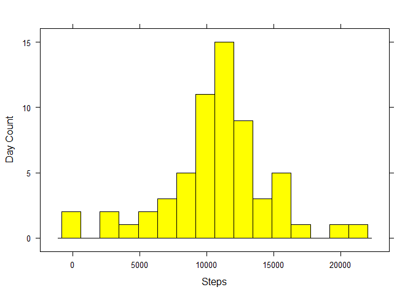

# Reproducible Research Peer Assessment 1
Dean A Wynkoop  
Thursday, August 13, 2015  

This research looks at steps collected by personal activity monitoring device(s).  This device collects data at 5
minute intervals from an anonymous individual collected during the months of October and November of November 2012
and include the number of steps taken in 5 minute intervals each day.

This research is a result of participation in John Hopkins Reproducible Peer Assessment 1 assignment instructed by
Dr. Roger D. Peng as part of the Coursera Data Science Specialization.


## Loading and preprocessing the data

```r
library(lattice)
actMonitor <- read.table("activity.csv", sep=",", header=TRUE)
```

## What is mean total number of steps taken per day?
The first part of this assignment will omit intervals with missing data and then produce a histogram showing days ~ steps

- Produce histogram and extract mean and median

```r
actMonitor1 <- na.omit(actMonitor)
actMonitor1ByDate <- aggregate(x=actMonitor1$steps, by=list(date=actMonitor1$date), FUN=sum)

histogram(actMonitor1ByDate$x, type="count", xlab="Number of Steps", ylab="Day Count", n=16)
```

 

```r
actMonitor1Mean <- mean(x=actMonitor1ByDate$x)
actMonitor1Median <- median(x=actMonitor1ByDate$x)
```


Mean = 1.0766189\times 10^{4}
Median = 10765

## What is the average daily activity pattern?
The second part of to create a visualization of average steps for each 5 minute interval

- Produce plot and extract maximum interval 

```r
actMonitor1ByInterval <- aggregate(x=actMonitor1$steps, by=list(interval=actMonitor1$interval), FUN=mean)

plot(actMonitor1ByInterval$interval, actMonitor1ByInterval$x, 
     pch = 4, xlab="Interval", ylab="Steps", 
     main="Steps by 5 Minute Intervals", sub="Peer Assessment 1",
     type="l", col="blue")
```

 

```r
maxInterval <- subset(actMonitor1ByInterval, x == max(x=actMonitor1ByInterval$x))
```

Interval with maximum average number of steps = 835
Maximum average number of steps = 206.1698113


## Imputing missing values
*Missing Values replaced by average steps for the time interval across the sample*

This third part of the project is to substitute average steps across the time interval for missing values and then compare the results.

- Replace the missing values, produce the histogram and extract mean and median.

```r
actMonitor2 <- actMonitor
actMonitor2$steps[is.na(actMonitor2$steps)] <- 
  ave(actMonitor2$steps, actMonitor2$interval, 
      FUN=function(x) mean(x, na.rm = T))[is.na(actMonitor2$steps)] 
actMonitor2ByDate <- aggregate(x=actMonitor2$steps, by=list(date=actMonitor2$date), FUN=sum)
histogram(actMonitor2ByDate$x, type="count", xlab="Steps", ylab="Day Count", n=16, col="yellow")
```

 

```r
actMonitor2Mean <- mean(x=actMonitor2ByDate$x)
actMonitor2Median <- median(x=actMonitor2ByDate$x)
```

Mean = 1.0766189\times 10^{4}
Median = 1.0766189\times 10^{4}

*Histogram looks more 'normalize' however the mean is not affected but the median becomes the same as the mean.  The sample data is missing observations for complete days so the mean for each day with missing observations is the same as the mean for each day with missing value replacement.


## Are there differences in activity patterns between weekdays and weekends?

- Prepare two plots comparing the weekends against week days.


```r
actMonitor2$when <- ifelse(weekdays(as.Date(actMonitor2$date), abbreviate=TRUE) == 'Sat' 
 | weekdays(as.Date(actMonitor2$date), abbreviate=TRUE) == 'Sun', 'weekend', 'weekday')

actMonitor2ByInterval <- aggregate(x=actMonitor2$steps, by=list(interval=actMonitor2$interval, when=actMonitor2$when), FUN=mean)

xyplot(x ~ interval | when, data = actMonitor2ByInterval, layout = c(1, 2), type='l', ylab="Number of Steps")
```

 
